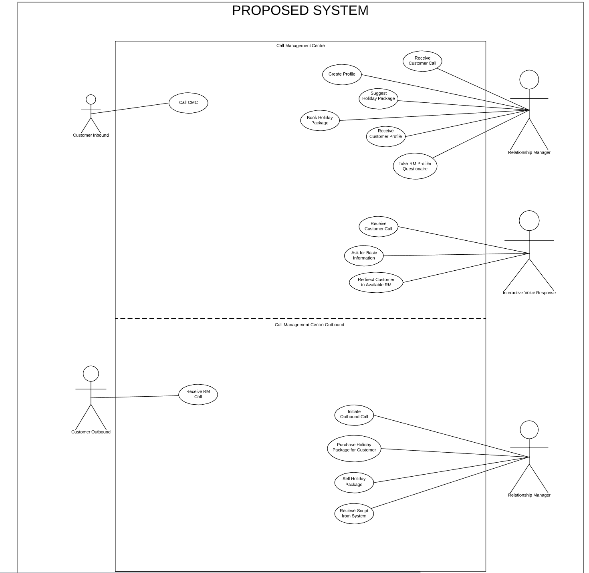
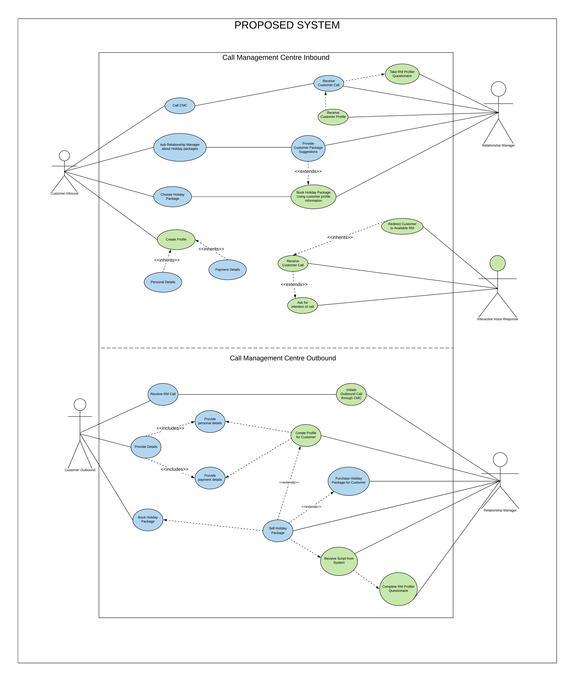
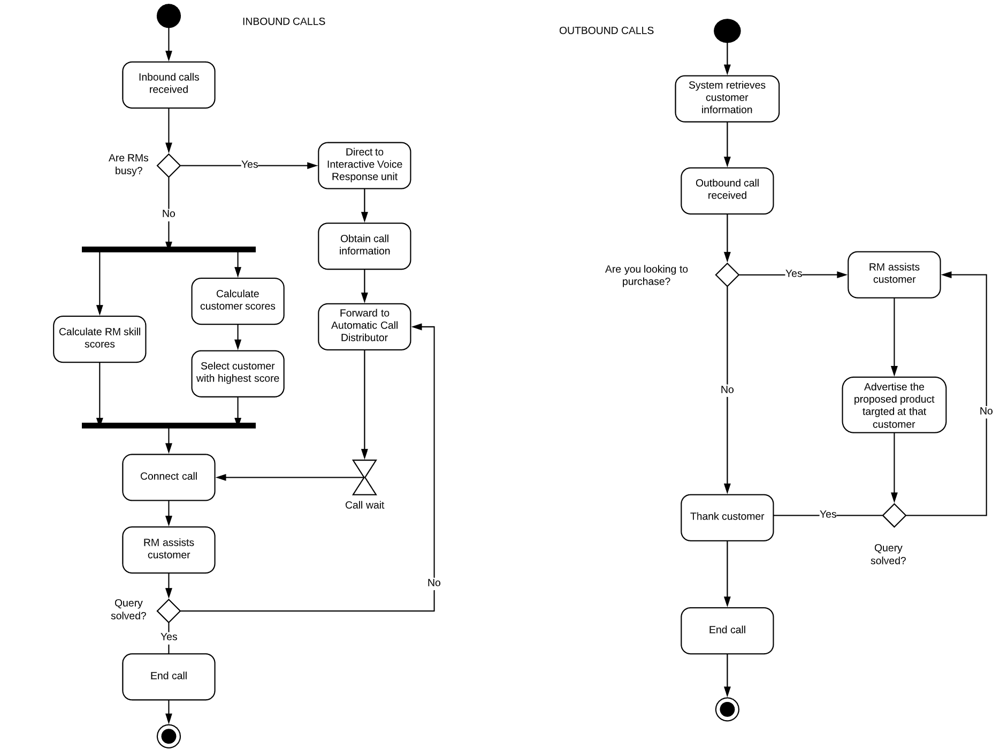
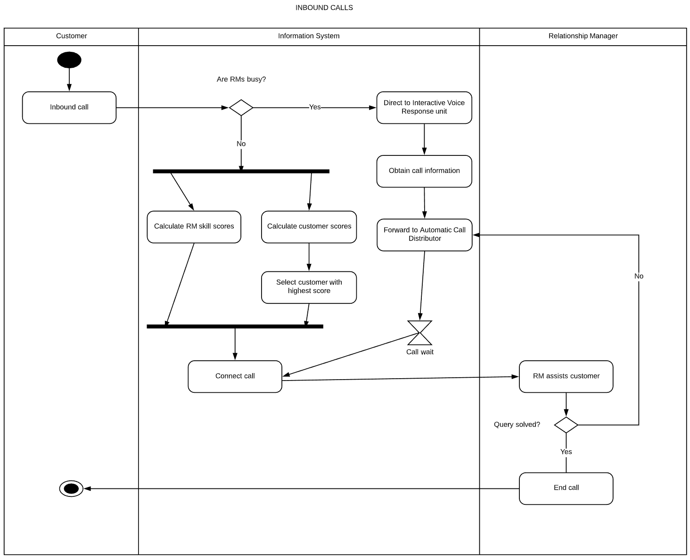
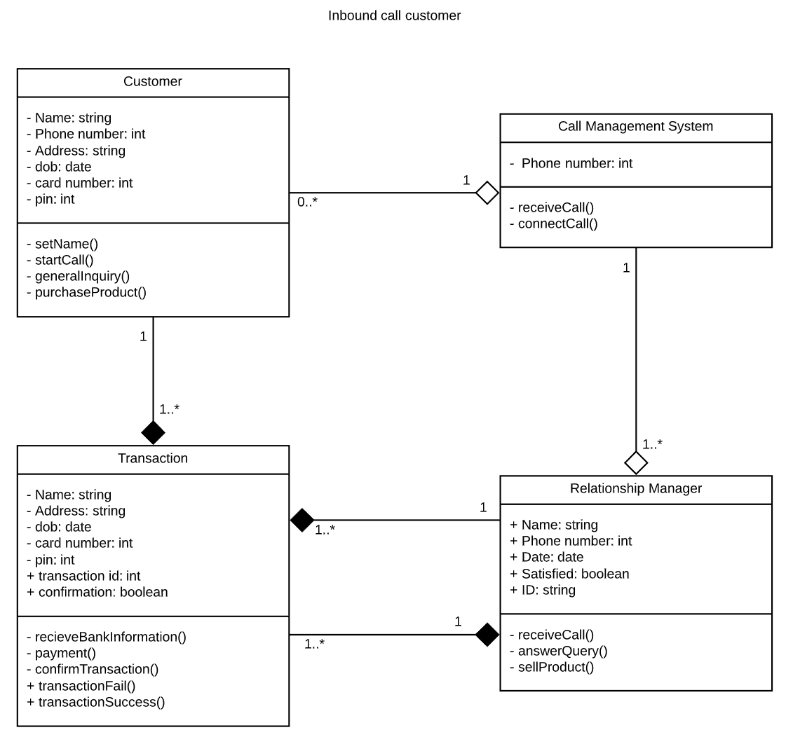
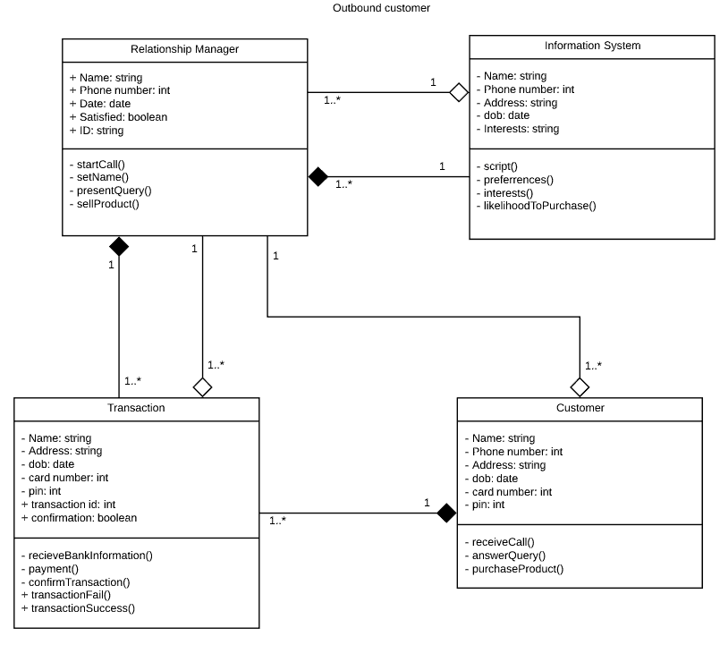

 # Call Management Center - Proposed Report

## Table of Contents
1. Acknowledgements
2. Executive Summary
3. Project Objectives
4. Problem Definition
5. Stakeholders
6. Design Thinking Principles Perspective
    * Empathy maps
    * POV Statements
    * Reflection
    * Assumptions
7. Agile Methodology
    * Scrum
    * Product backlog
8. Work-Products and Models
    * User Stories
    * Use Case Model
    * Activity Diagram
    * Class Diagram
    * Collaboration Diagram
9. Competitive Advantage
    * Possible effects of project failure

## Acknowledgements
We would like to thank the travel company, for allowing us to create and present this report detailing a new proposed call management system.

## Executive Summary
This report examines the problems surrounding the operations of a call management centre and recommends methods of increasing its efficiency and effectiveness.

The research showcases that the current system operation is complicated due to the number and nature of the holiday packages. Furthermore, wait times for customers are too long, tarnishing the relationship between the customer and relationship manager before the call begins. After the customer connects with a Relationship Manager, they don't have enough information about the customer, making the process and call rate slow and inefficient. These factors are the major causes to why the current system operation has problems.

The travel company is aiming to circumvent these issues by developing a new information system that improves the overall operations of the call management system. This report concludes that it would be ideal to satisfy its existing customer base while also attracting new potential customers due to the efficient and effective new information system.

## Project Objectives
The goal of this project is to improve the in-house call management centre of a major travel company.

## Problem Definition
We want our relationship managers to efficiently and effectively help customers purchase a travel package through our in-house call management centre.

However, the current operational system makes it difficult for relationship managers to sell due to long wait times, and Relationship Manager's not understanding the customers intentions fast enough. If we ignore this problem, we could potentially lose customers to competing company's, lose revenue and damage our overall company reputation.

To fix this issue, we will adopt a design thinking and scrum methodology to truly understand out customers and iteratively improve our operational system.

## Stakeholders
1. Inbound calling customers

    Customers calling the travel company whom are looking to purchase a travel package

2. Outbound called customers

    The travel company calling potential customers who may be interested in purchasing

3. Relationship Manager

    The employee who is interacting with the customer

4. Travel Company

    The company that operates the call management centre

5. Call management centre

    Part of the business that controls the calls with customers

6. Competing travel company's

    Business's that are similar to the travel company that may attract their own customers.

7. Call centre manager

    Supervisor who is in charge of running and operating the call management centre

## Design Thinking Principles Perspective
**Empathy Maps**
* Inbound calling customer

* Outbound called customers

* Relationship Manager

* Travel Company

**POV Statements**
1. "I am an inbound calling customer trying to purchase a travel package, but I'm frustrated with the service I am receiving from the Travel Company as the wait times are long and they don't understand my intentions well. This makes me feel irritated and impatient."
2. "I am an outbound called customer trying to enjoy my day, but it is annoying to receive calls from a company asking to purchase their products as I need to do research, sort my schedule and need more time before I can make a purchasing decision. This makes me feel displeased and frustrated."
3. "I am a Relation Manager trying to better serve my customers. Whenever I get connected, their initial attitude is always negative due to long wait times. I sometimes forget what the optimal travel package for them is, since I have to deal with so many different customers. This makes me frustrated."
4. "We are a Travel Company trying to improve the in-house call management centre, but it is too difficult for our employees to help customers purchase a travel package due to long wait times and misunderstanding the customer's intentions. This makes me feel anxious and aggravated."

**Reflection**

We started the project by assigning different roles to each group members to ensure that we are able to complete the project within the allotted time frame. We broke down the roles based on every members strengths and weaknesses.

However, with the current situation surrounding the virus, there are various issues surrounding the case study during Design Thinking. We had a group discussion on the issues we encountered and how we would overcome them. This includes reduced face-to-face communication, unable to interview real actors, and gaining real-world data. We overcame this by utilising the internet, different social network sites and making assumptions on the case study to understand the major stakeholders of the case and their situation. This allowed us to successfully progress through the project, despite the external factors.

Our Design Thinking methodology started with a brainstorm of different stakeholders relating to the case study. We  decided to use the customer, relationship manager and travel company for our empathy maps as they were the major stakeholders surrounding the case study. However, with further consultation with the tutor, we split the customer into two and utilised inbound called customer, outbound calling customers, relationship manager and the travel company for our empathy maps as they posed more in-depth discussion and analysis.

Next, we created our empathy maps for our major stakeholders on Lucidchart. Using Lucidchart was difficult at first as we needed a premium membership to fully utilise all of its features. We overcame this by connecting our accounts to our school email allowing us access to the premium membership. Lucidchart was helpful as we could all collaborate online in real-time which made it efficient and effective. Furthermore, it also has features that will help us create our diagrams and models later down the track.

With the POV statements, it was found that every stakeholder involved is affected by the current operation of the call management centre. It was more difficult for employees to do their job and drove customers away to competing company's primarily due to the long wait times and misunderstanding between RM and customer.

After creating the POV statements, there are various external factors that halted the steady progress of the project from all the group members. This involved external assessments from other subjects which took up time and productivity from the progression of the project. We overcame this by identifying the issue and decided as a group to dedicate some time each week to this project to ensure its progression towards the due date.

With the creation of the POV statements, we started work on the How Might We questions relating to the project. The POV statements helped shape the scope of our questions. This is relayed below:
1. How might we improve the relationship between the customer and RM?
2. How might we improve the customer's experience while they're calling?
3. How might we speed up the call rate for RM's?
4. How might we increase the RM's performance and product knowledge?
5. How might we recommend better purchase options for our customers?

This formed the basis of our design thinking methodology for the project. Following all these steps allowed us to get a better understanding of the stakeholders and empathise with whom we are designing the project for. After the design thinking stage, we arranged another group meeting to discuss our thoughts and move on to the next stage which was the agile methodology. In this stage, we utilised a Scrum agile method to progress through the various diagrams and models.

**Assumptions**

* RM's are frustrated with the long wait times like the customers
* RM's don't understand their customers well as they calls are being sent to RM's randomly
* The travel company doesn't have an online website for customers to find holiday and travel packages
* Customers create their customer profile by utilising the Profiler Tool
* RM's wont be able to see their own profiles to keep morale up
* The new system wont slow down the call operations as customers with customer profiles will be prioritised over customers without one
* Outbound called customers are not current customers for the Travel Company
* The company is losing revenue and market share due to competitors, which is why they want to develop a new information system

## Agile Methodology
An appropriate system development methodology will be utilised to plan, structure and control the development of the Call Management Centre.

In agile methodology, various parts of the system are worked on concurrently, as opposed to the sequential order of activities in traditional waterfall methodology. Projects are developed in iterations and stages, with constant testing, review and feedback with stakeholders, providing continuous improvement with each iteration and a focus on communication, collaboration and adaptation. This enables any changes, including requirements, to be implemented at any stage of development.

### SCRUM
Agile Methodology is a project management process that is primarily used by software developers involving self-organisation and collaboration across teams. It involves working on multiple tasks at once in smaller builds through iterations, testing and reviewing with stakeholders regularly throughout the project. 

The Scrum events we used were the sprint retrospective and the scrum cycle. This is because these two events suited our timelines well as we didn't have enough time to meet daily due to other commitments. The Sprint Retrospective allowed us to look back at our backlog and timeline of commits to identify current issues and determine methods in further improving the project. The Scrum Cycle allowed us to incrementally work on the project and help us prioritise the most important methods needed to complete the project. 

As such, we employed a variety of scrum artefacts including the product backlog and a sprint backlog. The product backlog showcases a prioritised list of user stories and tasks for the project (see below). The Sprint backlog can be seen through our Kanban board in GitHub which showcases our progression and timeline of our tasks and the various issues we encountered throughout the project. 

We would hold a weekly Scrum meeting every Friday to determine the outcome of our tasks and allow us to incrementally complete the project within the given deadline. We assigned different roles to each group member to help us iteratively work on the project without task dependency. For example, each team member was given a diagram to create and model based on the completed user stories, showcasing the improvements in the proposed system compared to the current system.

**Product Backlog**

| ID  | User Story  |  Priority (High, Medium, Low) |
|---|---|---|
|  US1 |  As an inbound calling customer, I want to dial a number without waiting too long, so that I can purchase a travel package |    Medium  |
| US2  | As an inbound calling customer, I want to be able to talk to someone on the phone that knows my intentions well, so that I can buy holiday packages  |   High  |
| US3  | As an inbound calling customer, I want to purchase a travel package so that I can visit holiday destinations  |    Low  |
| US4  | As an inbound calling customer, I want to use a tool to create a customer profile, so that I can be allocated to a RM who is best suited to me  |    Medium  |
| US5  | As an outbound called customer, I want to talk to a RM that get straight to the point, so that it doesn't waste my time  |    Medium  |
| US6  | As an outbound called customer, I want to purchase a travel package that suits my needs, so that I can save time  |    Low  |
| US7  | As a relationship manager, I want customers to get their calls answered so that I can sell them holiday packages  |    High  |
| US8  | As a relationship manager, I want to view the details of a customer, so that I can understand who I am talking with  |    Medium  |
| US9  | As a relationship manager, I want to be given a script, so that I can provide an improved service to the customer  |    Medium  |
| US10  | As a travel company, I want to develop a system so that I can improve the call management centre  |   High  |
| US11  | As a travel company, I want to improve the call flow rate, so that I can make more sales  |    High  |
| US12  | As a travel company, I want to be able to create profiles based on my relationship managers and customers so that I can match my relationship managers with customers to increase sales  |    Medium  |
| US13  | As a travel company, I want to be able score a call from 1-10 so that we can find which customers are most likely to buy from us.  |    Medium  |
| US14  | As a travel company, I want to ensure customers with a high score are prioritised, so that they can buy holiday packages from us  |    Medium  |
| US15  | As a travel company, I want customers to be directed to an interactive voice response unit so that it can answer any questions if a relationship manager is not available  | Low  |
| US16  | As a call management centre, I want the system to use AI machine learning, so that it can automatically assign customers to a suitable relationship manager  | Low  |
| US17  | As a call management centre, I want to ensure the system is running smoothly, so that customers and relationship managers are not impacted in their calls | Medium  |
| US18  | As a competing travel company, I want to take away as many customers from my main rivals, so that I can make more sales and revenue | Low  |
| US19  | As a call centre manager, I want the call rates to be improved for RM's, so that they are able to interact with the customers more often | Low  |

| ID  | Task  |  Priority (High, Medium, Low) |
|---|---|---|
| T1  |  Create Empathy Maps and POV statements  | Medium |
| T2  |  Create Backlog  | High |
| T3  |  Create model diagrams  | Medium |
| T3.1  |  Subtask - Create use case diagrams  | Medium |
| T3.2  |  Subtask - Create activity diagrams  | Medium |
| T3.3  |  Subtask - Create class diagrams  | Medium |
| T3.4  |  Subtask - Create collaboration diagrams  | Medium |
| T4    | Competitive advantages and potential effects | Medium |
| T5  |  Edit and finalise documentation  | Low |
| T6  |  Start the video presentation | Medium  |
| T7  |  Assign roles and begin recording | Low  |
| T8  |  Upload the final video presentation | High  |
| T9  |  Upload final document | High  |

## Work-products and Models
**User Stories**
These are the user stories that we will focus on modelling:
1. As an inbound calling customer, I want to be able to talk to someone on the phone that knows my intentions well, so that I can buy holiday packages
2. As an outbound called customer, I want to talk to an RM that get straight to the point, so that it doesn't waste my time
3. As a relationship manager, I want to view the details of a customer, so that I can understand who I am talking with
4. As a travel company, I want to develop a system so that I can improve the call management centre

**Use Case Model**

The use case model was created by utilising the user stories. Similar to the Empathy maps, we will be using Lucidchart to collaborate online and complete the use case model. This use case model showcases a simple representation of the user's interaction and relationship with the system. As emphasised through the model, it visually showcases how effective the proposed system is compared to the current system as there are less prompts for the actor to interact with. Everything is done in the background, which increases their mood.

Initially, we experienced issues as we were confused on how to create the use case models since there are many versions that can be created. We decided to create two use case models showcasing the current call management system and another one for the proposed system that is going to be developed. We started by listing the title, actors and their associated use cases. This was the prototype model that we created. We would continue to iterate on this base diagram later by adding relationships.

* Current System (Beginnning)

* Proposed System (Beginning)

* Version 2 Inbound & Outbound (Pre-Consultation)

After some discussions with the tutor, we decided to use his feedback and create one  use case diagram containing both the current and proposed system. It was mentioned that use cases could be distinguished by colour coding the proposed system. This will give a better comparison and view on how the proposed system will help the call management system in a single glance & will clearly showcase the improvements that the proposed system will make. This means we needed to reconfigure the entire use case model by combinign the 2 models and adding relationships that showcase the differences made from the proposed system.

* Use Case Diagram Final

The end result was a singular more consise diagram which was coloured based on new and retaining use cases. New use cases were expressed in green whilst retaining use cases were displayed in blue. It was decided that unused use cases should not be shown in the diagram in order to minimised confusion. 

Some insights that could be deduced from visualising the Use Case Diagram in this way was which stakeholders were impacted by the proposed changes. From the colour distribution we can conclude that Relationship Managers have more changes implemented while the customer journey is relatively untouched.

**Activity Diagram**

An activity diagram is a visual representation of the workflow of steps and actions that occurs when the customer interacts with the system. It starts at the top and flows downwards, showcasing different steps and actions that are required by the customer or relationship manager. As showcased through the diagram, most of the steps are in the background, and doesn't involve the consumer. This makes things more efficient as the relationship manager already has all the information available to them, and maximises their chance of selling the product to the customer.

We experienced some trouble with the Activity diagram as we weren't sure how specific or brief we needed to be. Furthermore, we weren't sure whether to model the current system or the proposed system However we opted to make the activity diagrams succinct and easy to read without compromising the amount of information. We created two separate activity diagrams that detail the series of events that inbound calling customers and outbound called customers will go through on the proposed system.

However after creating the diagrams, we planned a group discussion later in the week where further edits will be made to the activity diagram to help finalise it. With the edited activity diagrams, we added columns for the stakeholders, which better visualises the diagrams and showcases the differences between the two stakeholders. Furthermore, it conveys the flow of activities and the different actions that are completed throughout the process.

**Class Diagram**

A class diagram showcases the system's classes, attributes, operations and relationships among objects. The listed class diagrams showcases the base system we wish to design. However, we experienced trouble as we were unsure whether we needed to be more specific with more classes and relationships. We decided to create a simple outline of the proposed system for the two major stakeholders being the inbound customer and outbound customer. It showcases the relationship that the customer and relationship manager will go through when interacting with the system. As represented in the diagrams, the proposed system has very little wait time and allows the customer to get what they want efficiently and effectively.

**Collaboration Diagram**

A collaboration diagram is used to showcase the relationships and interactions between objects in Unified Modelling Language (UML). It defines the role of each object.

## Project Advantages & Failures
**Competitive Advantage Gained**

The new system will provide substantial efficiency improvements in handling both incoming and outgoing calls. Dynamic and intelligent matching of customers to an appropriate Relationship Manager (RM) based on their respective profiles ensures the RM has the right skills and knowledge to resolve customer enquiries within a timely manner. Successful matching will also prevent the need for the customer to be transferred around to various RMs, saving both time and resources.

In addition, customer profile information allow RMs to provide more personalised, meaningful and accurate support through greater insights and deeper understanding regarding the needs and requirements of each customer.

These two competitive advantages combined result in increased customer satisfaction and employee wellbeing. Providing customer satisfaction achieves competitive advantage over competitors through obtaining customer loyalty, and the attraction of new customers through word of mouth.

Finally, the new system is able to provide insights from collated profiles, interactions and data to form trends and patterns that will better enable the travel company to address customer needs, and align their business to cater for their requirements. For example, trends may reveal that a number of customers are enquiring about a particular travel destination that is not currently offered. Hence, the travel company has potential to gain competitive advantage by looking into offering the highly demanded destination.

**Possible Adverse Effects of Project Failure**

Insufficient management, poorly defined project goals and objectives, and a combination of other factors can lead to project failure.

The first implication would be financial losses. These include the loss in the direct expenses of developing the project, and investment loss, where the opportunity for increased cash flows, decreased expenses or higher turnover that the project were to deliver are lost.

Project failure would also leave a negative image on the reputation of the travel company or the contractor. This will have a direct negative impact on future business prospects, opportunities and market share from the loss of credibility and reputation from stakeholders, investors and business partners.

Finally, failure in successfully delivering the project will leave the initial project requirements to be partially completed, or even completely unfulfilled. Projects are generally pursued with relation to business goals and objectives, and hence any failure will lead to adverse effects on the travel company, including financial consequences and delays in future business prospects. The initial problems such as long call wait times, low customer satisfaction and process inefficiencies would continue to exist, leading to organisational failure and allowing competitors to gain advantage. 
