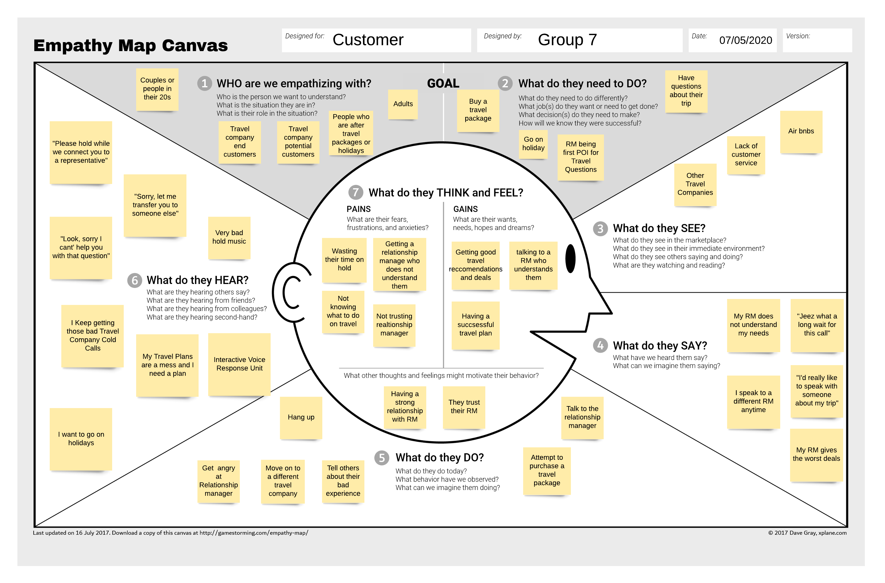
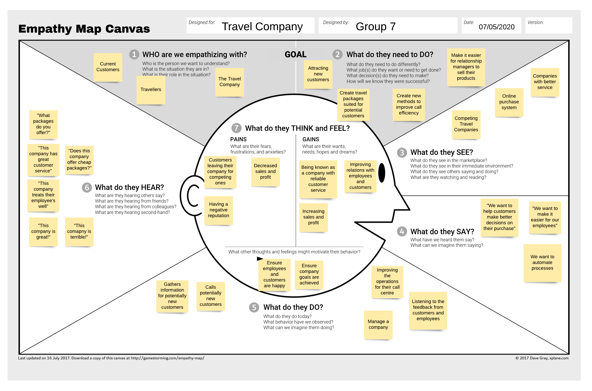
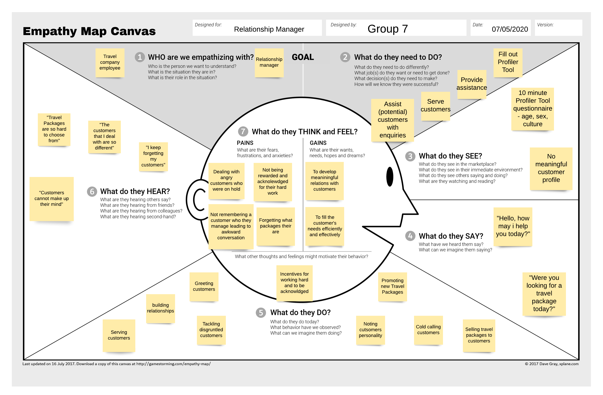

# Call Management Center - ISDM Report
**Problem Definition**

**Design Thinking**

**Competitive Advantages & Possible effects of project failure**

## Objectives
The goal of this project is to improve the in-house call management centre of a major travel company.

### Problem
The problem is that the current system makes it difficult for Relationship Managers to efficiently and effectively help customers purchase a travel package. This is due to long wait times for customers and RM's not understanding the customers intentions quickly enough, making the whole process slow and cumbersome.

## Stakeholders
1. Customer
2. Relationship Manager
3. Travel Company
4. Call management centre
5. Competing travel company's
6. Call centre manager

## Design Thinking Principles Perspective
**Empathy Maps**
* Customer

* Relation Manager

* Travel Company

**Three POV Statements**
1. "I am a Customer trying to purchase a travel package, but i'm frustrated with the service i am receiving from the Travel Company as the wait times are long and they dont understand my intentions well. This makes me feel irritated and impatient" 
2. "I am a Relation Manager trying to better serve my customers. Whenever i get connected, their initial attitude is always negative due to long wait times. I sometimes forget what the optimal travel package for them is, since i have to deal with so many different customers. This makes me frustrated."
3. "I am a Travel Company trying to improve the in-house call management centre, but it is too difficult for our employees to help customers purchase a travel package due to long wait times and misunderstanding the customer's intentions. This makes me feel anxious and aggravated."

**Reflection**

Due to the curent situation surrounding the virus, there various issues surrounding the case study during Design Thinking. We came together as a group and had a group discussion to discuss the surrounding issues and how we would overcome them. 

We decided to use the customer, relation manager and travel company for our emapthy maps as they were the major stakeholders surrounding the case study.

With the POV statements, it was found that every stakehodler involved is affected by the current operation of the call management centre. It was more difficult for employees to do their job and drove customers away to competing company's primarily due to the long wait times and misunderstanding between RM and customer.

Below are the assumptions we made about the case study to continue with the project.
Assumptions:
* RM's are frustrated with the long wait times like the customers 
* RM's dont understand their customers well as they calls are being sent to RM's randomly
* The travel company doesnt have an online website for customers to find holiday and travel packages
* Customers create their customer profile by utilisng the Profiler Tool
* RM's wont be able to see their own profiles to keep morale up
* The new system wont slow down the call operations as customers with customer profiles will be prioritised over customers without one

**Product Backlog**
| ID  | User Story  |  Estimation (1-10) | Priority (High, Medium, Low) |
|---|---|---|---|
|  US1 |  As a customer, I want to purchase a travel package so I can visit holiday destinations | 5  | Medium  |
|   |   |   |   |
|   |   |   |   |
|   |   |   |   |
|   |   |   |   |
|   |   |   |   |
|   |   |   |   |
|   |   |   |   |
|   |   |   |   |
|   |   |   |   |
|   |   |   |   |
|   |   |   |   |
|   |   |   |   |

## Agile Methodology

### SCRUM

## Assumptions

## Workproducts and Models

## Competitive Advantage

